Exploring wind farm data (I): data preprocessing, visulization and
preliminary analysis
================

## I. Introduction of the three posts

The three posts try to expore 10 large sets of wind farm data where each
one contains 16,800 data points. Although based on the same data set,
the three posts focus on differents aspects.

> Post 1 focuses on the data preprocessing, visualization and some
> preliminary analysis.

> Post 2 focuses on a practical method for anomaly detection or
> maintenance event detection.

> Post 3 focues on the cluster analysis.

The purpose of these three posts are threefolds.

> First, they are final projects in my data mining class and each post
> focuses on different aspects of what we learnt in the class.

> Second, they aim at providing the wind farm owners and electric power
> system operaters with some insights from the huge data sets.

> Finally, they can serve as tutorials for 1st year PhD student in
> power/energy/electrical engineering, so that they can have a basic
> idea to deal with the realistic wind power data in their
> course/reserach projects.

The following sections are organized as follows.

> Section II introduces how to access the data source and explains the
> data set in detail.

> Section III gives the problem description of post 1.

> Section IV performs data preprocessing from several aspects

> Section V conducts some basic data visualization and preliminary
> analysis

## II. Data source and data descprition

### 1 Data source

The data comes from Ref \[1\] and can be downloaded by the link in
\[2\].

> \[1\] Tao Hong, Pierre Pinson, Shu Fan, Hamidreza Zareipour, Alberto
> Troccoli and Rob J. Hyndman, “Probabilistic energy forecasting: Global
> Energy Forecasting Competition 2014 and beyond”, International Journal
> of Forecasting, vol.32, no.3, pp 896-913, July-September, 2016.

> \[2\]
> <http://blog.drhongtao.com/2017/03/gefcom2014-load-forecasting-data.html>

It is orignally prepared for a global competition. The wind farm data
used in this post can be obtained by following steps. We select the data
for Task 15 because it contains the largest number of data points.

> 1)  unzip the file “GEFCom2014-W\_V2.zip”

> 2)  go the the directory: wind \>\> Task15\>\>Task15\_W\_Zone1\_10

### 2 Data decription

The folder contains 10 csv files for 10 wind farms.Each csv file
contains 16,800 data points recorded at every hour, which is equivalent
to 700-day historical data from Jan. 1st, 2012 to Dec. 1st, 2013. We
will combine the data of the 10 wind farms together and the final data
set contains 168,000 data points.

Each data point has 7 attributes. Their meanings are below.

> 1 ZONEID. It means the ID of a wind farm, ranging from 1 to 10.

> 2 TIMESTAMP. It is in the format of “20120101 1:00” which gives the
> year, month, date and hour information.

> 3 TARGETVAR. It means wind power generation, which has been normalized
> by the nominal capacities of each wind farm.

> 4-5 U10 and V10. They means the wind speeds along u and v directions
> at the height of 10 meters. The u and v directions refer to zonal and
> meridionoal directions.

> 6-7 U100 and V100. Similar with U10 and V10, but they mean the wind
> speed measured at the height of 100 meters.

## III. Problem description of Post 1

Due to the climate change, the traditional energy resources are
gradually replaced by renewable energies in recent years. The most
promising renewable energy is wind power. However, the wind has very
strong stochastic attribute and the wind power is very hard to be
accurately predicted. This poses a great challenge to electric power
system operators and may make the power system not secure any more. To
ensure the secure operation, we need to improve the wind power
forecasting accuracy. There are many efforts in the power system
community.

This post 1 focuses on the data preprocessing, visualization and some
preliminary analysis. The main goal is to

> 1)  Convert some atributes and add new attributes to the data set, for
>     the convenience of further analysis

> 2)  Give an overview visualization of the data set for wind farm
>     owners and electric power system operators

> 3)  Provide wind farm owners and the electric power system operators
>     some preliminary analysis results

## IV. Data preprocessing

### 1\. Read the 10 csv data files into R and combine them together

``` r
ZoneNo <- 1:10      # we have ten wind farms
data <- data.frame()
for(i in ZoneNo)
{ 
  temp <- read.csv(paste("./Input/Task15_W_Zone",i,".csv",sep=""), header=T, dec='.', na.strings=c('NA'))
  data <- rbind(data, temp)
}
head(data,3)
```

    ##   ZONEID     TIMESTAMP  TARGETVAR      U10        V10     U100      V100
    ## 1      1 20120101 1:00 0.00000000 2.124600 -2.6819664 2.864280 -3.666076
    ## 2      1 20120101 2:00 0.05487912 2.521695 -1.7969601 3.344859 -2.464761
    ## 3      1 20120101 3:00 0.11023400 2.672210 -0.8225162 3.508448 -1.214093

``` r
nrow(data)
```

    ## [1] 168000

``` r
summary(data)
```

    ##      ZONEID              TIMESTAMP        TARGETVAR      
    ##  Min.   : 1.0   20120101 1:00 :    10   Min.   :0.00000  
    ##  1st Qu.: 3.0   20120101 10:00:    10   1st Qu.:0.08087  
    ##  Median : 5.5   20120101 11:00:    10   Median :0.28104  
    ##  Mean   : 5.5   20120101 12:00:    10   Mean   :0.36033  
    ##  3rd Qu.: 8.0   20120101 13:00:    10   3rd Qu.:0.60581  
    ##  Max.   :10.0   20120101 14:00:    10   Max.   :1.00000  
    ##                 (Other)       :167940                    
    ##       U10               V10                 U100        
    ##  Min.   :-8.3716   Min.   :-12.92358   Min.   :-12.425  
    ##  1st Qu.:-1.5017   1st Qu.: -2.15818   1st Qu.: -2.410  
    ##  Median : 0.5451   Median :  0.36381   Median :  1.056  
    ##  Mean   : 0.8188   Mean   :  0.08909   Mean   :  1.283  
    ##  3rd Qu.: 2.8055   3rd Qu.:  2.34191   3rd Qu.:  4.754  
    ##  Max.   :14.8372   Max.   : 11.40140   Max.   : 21.399  
    ##                                                         
    ##       V100           
    ##  Min.   :-19.791997  
    ##  1st Qu.: -3.864192  
    ##  Median :  0.709303  
    ##  Mean   :  0.009308  
    ##  3rd Qu.:  4.072244  
    ##  Max.   : 16.304799  
    ## 

### 2\. Convert and extract new attributes from TIMESTAMP

The outlier detection method in this post depends on the the wind speed
and wind power at several consecutive hours, so it is necessary to
extract the hour attributes from the original attribute TIMESTAMP. This
is achieved by a date-time conversion function " strptime".

``` r
# Force the attribute "ZONEID" as a factor with levels from 1 to 10
data$ZONEID <- as.factor(data$ZONEID)

# Convert the attribute "TIMESTAMP" into the class "POSIXt" to represent calendar dates and times
data$TIMESTAMP <- strptime(data$TIMESTAMP, format="%Y%m%d %H")

# Extract new attributes year, month, date and hour from TIMESTAMP 
data$YEAR  <- as.numeric(format(data$TIMESTAMP, "%Y"))  # Calendar year with the century   (i.e. 2012/2013/2014/...)
data$MONTH <- as.numeric(format(data$TIMESTAMP, "%m"))  # Calendar month as decimal number (i.e. 01/02/.../12)
data$DAY   <- as.numeric(format(data$TIMESTAMP, "%j"))  # Day of year as decimal number    (i.e. 001/002/.../365 or366)
data$HOUR  <- as.numeric(format(data$TIMESTAMP, "%H"))  # Hours as decimal number          (i.e. 00/01/.../23)
```

### 2\. Convert the wind speed given by u and v to an absolute value of wind speed and the angle in degree.

In the data set, the wind speed is measured along a u direction and a v
direction because they are easy to measure. But these orginal
measurements are not convenient to use in the analysis. Usually, wind
farm owners are more interested in the absolute value of the wind speed
and the wind direction given by a angle in degree. Therefore, it is
necessary to preprocess the the attribute U10, V10, U100 and V100. The
method to convert the attribute is shown in the code. Finally, we get
four new attributes:

> WS10 : Wind speed at 10 meters height

> WS100 : Wind speed at 100 meters height

> WD10: Wind direction at 10 meters height

> WD100: Wind direction at 100 meters height

``` r
# 
data$WS10  <- sqrt(data$U10^2  + data$V10^2)
data$WD10  <- 180/pi*atan2(data$U10,  data$V10)
data$WD10  <- ifelse(data$WD10>=0,  data$WD10,  data$WD10+360)

data$WS100 <- sqrt(data$U100^2 + data$V100^2)
data$WD100 <- 180/pi*atan2(data$U100, data$V100)
data$WD100 <- ifelse(data$WD100>=0, data$WD100, data$WD100+360)
```

### 3\. Add the new attributes and form the raw data set

``` r
name <- c("TIMESTAMP", "YEAR", "MONTH", "DAY", "HOUR", "ZONEID", "TARGETVAR", "U10", "V10", "WS10", "WD10", "U100", "V100", "WS100", "WD100")
data <- data[, name]
head(data,3)
```

    ##             TIMESTAMP YEAR MONTH DAY HOUR ZONEID  TARGETVAR      U10
    ## 1 2012-01-01 01:00:00 2012     1   1    1      1 0.00000000 2.124600
    ## 2 2012-01-01 02:00:00 2012     1   1    2      1 0.05487912 2.521695
    ## 3 2012-01-01 03:00:00 2012     1   1    3      1 0.11023400 2.672210
    ##          V10     WS10     WD10     U100      V100    WS100    WD100
    ## 1 -2.6819664 3.421530 141.6144 2.864280 -3.666076 4.652334 141.9997
    ## 2 -1.7969601 3.096451 125.4737 3.344859 -2.464761 4.154892 126.3858
    ## 3 -0.8225162 2.795932 107.1086 3.508448 -1.214093 3.712577 109.0881

``` r
nrow(data)
```

    ## [1] 168000

``` r
summary(data)
```

    ##    TIMESTAMP                        YEAR          MONTH       
    ##  Min.   :2012-01-01 01:00:00   Min.   :2012   Min.   : 1.000  
    ##  1st Qu.:2012-06-24 01:00:00   1st Qu.:2012   1st Qu.: 3.000  
    ##  Median :2012-12-16 00:30:00   Median :2012   Median : 6.000  
    ##  Mean   :2012-12-16 00:05:59   Mean   :2012   Mean   : 6.278  
    ##  3rd Qu.:2013-06-09 01:00:00   3rd Qu.:2013   3rd Qu.: 9.000  
    ##  Max.   :2013-12-01 00:00:00   Max.   :2013   Max.   :12.000  
    ##  NA's   :20                                                   
    ##       DAY             HOUR           ZONEID        TARGETVAR      
    ##  Min.   :  1.0   Min.   : 0.00   1      :16800   Min.   :0.00000  
    ##  1st Qu.: 88.0   1st Qu.: 5.75   2      :16800   1st Qu.:0.08087  
    ##  Median :176.0   Median :11.50   3      :16800   Median :0.28104  
    ##  Mean   :175.9   Mean   :11.50   4      :16800   Mean   :0.36033  
    ##  3rd Qu.:263.0   3rd Qu.:17.25   5      :16800   3rd Qu.:0.60581  
    ##  Max.   :366.0   Max.   :23.00   6      :16800   Max.   :1.00000  
    ##                                  (Other):67200                    
    ##       U10               V10                 WS10         
    ##  Min.   :-8.3716   Min.   :-12.92358   Min.   : 0.02323  
    ##  1st Qu.:-1.5017   1st Qu.: -2.15818   1st Qu.: 2.48800  
    ##  Median : 0.5451   Median :  0.36381   Median : 3.71637  
    ##  Mean   : 0.8188   Mean   :  0.08909   Mean   : 3.99664  
    ##  3rd Qu.: 2.8055   3rd Qu.:  2.34191   3rd Qu.: 5.17383  
    ##  Max.   :14.8372   Max.   : 11.40140   Max.   :15.23372  
    ##                                                          
    ##       WD10               U100              V100           
    ##  Min.   :  0.0056   Min.   :-12.425   Min.   :-19.791997  
    ##  1st Qu.: 75.5678   1st Qu.: -2.410   1st Qu.: -3.864192  
    ##  Median :159.3929   Median :  1.056   Median :  0.709303  
    ##  Mean   :169.3653   Mean   :  1.283   Mean   :  0.009308  
    ##  3rd Qu.:264.1550   3rd Qu.:  4.754   3rd Qu.:  4.072244  
    ##  Max.   :359.9943   Max.   : 21.399   Max.   : 16.304799  
    ##                                                           
    ##      WS100              WD100        
    ##  Min.   : 0.01282   Min.   :  0.004  
    ##  1st Qu.: 4.67847   1st Qu.: 73.888  
    ##  Median : 6.39217   Median :155.943  
    ##  Mean   : 6.58406   Mean   :167.483  
    ##  3rd Qu.: 8.23088   3rd Qu.:262.731  
    ##  Max.   :22.15552   Max.   :359.998  
    ## 

``` r
save(data,file=paste("./RData/Raw_Data.Rdata",sep=""))
```

## V. Basic data visualization and preliminary analysis

There are several things that the wind farm operators want to see when
given a data set.

### 1\. What is the distribution of wind speed at different heights?

It shows that the wind speeds at 10 meters heights are usually smaller
than those at 100 meters heights. Most wind speeds are 3 meters per
second at 10 meters high while are 7 meters per second at 100 meters
high.

``` r
hist(data$WS10)
```

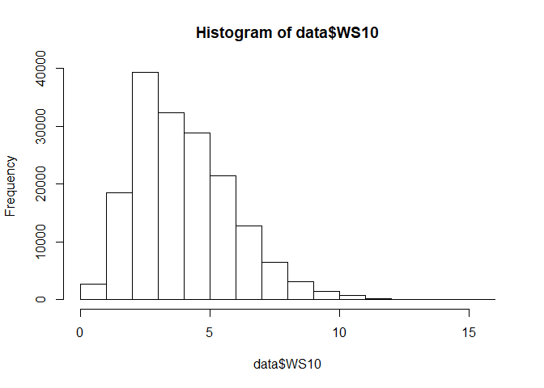<!-- -->

``` r
hist(data$WS100)
```

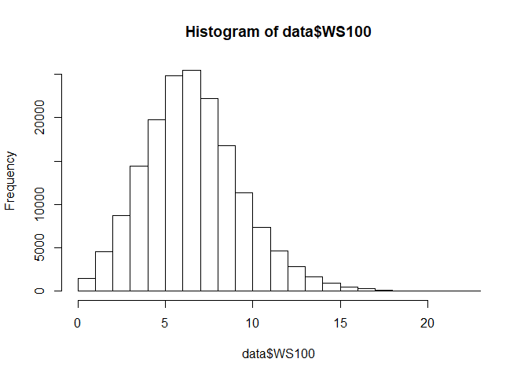<!-- --> \#\#\# 2.
What is the distribution of wind power?

It shows that, a very large portion of data points have zero wind power.
That’s why they can not be directly regarded as outliers and be deleted,
becasue this will reduce the number of data points a lot. Also, it is
too aggresive to delete all the data points with zero wind power because
some zero power data points are normal data. We need to find a better
way to differentiate the real outliers and the normal data points.

Also, it is interesting that most wind powers tend to go to the two
extremes, i.e., they tend to have very small values (near zero) or very
large values (near one). They rarely have median values. One possible
reason is that, wind turbine can only generate wind power with a given
range of wind speed, i.e., \[WS\_min, WS\_max\].

``` r
hist(data$TARGETVAR)
```

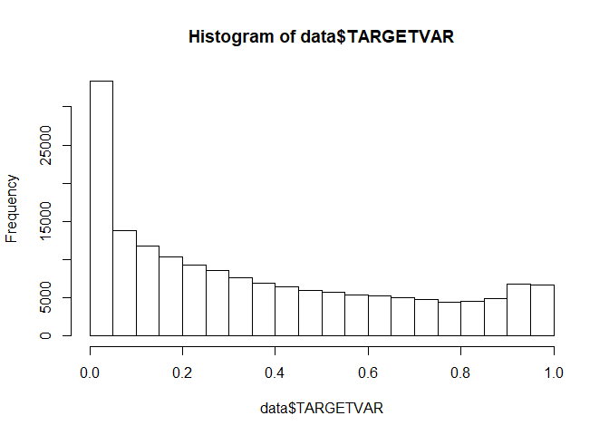<!-- -->

### 3\. Any relationships between wind power and wind speed?

The wind power increases with the wind speed no matter which wind speed
is used, i.e., at 10 meters high, 100 meters high, or their average. It
also shows that: the wind power not only depends on the wind speed, but
also depends on some other factors.

``` r
plot(data$WS10,data$TARGETVAR)
```

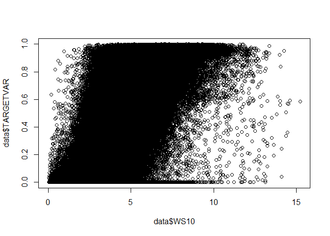<!-- -->

``` r
plot(data$WS100,data$TARGETVAR)
```

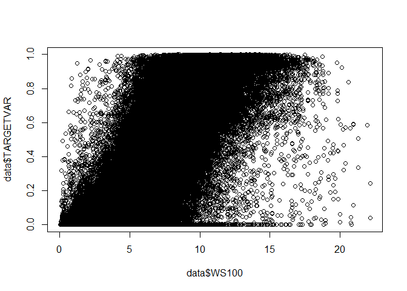<!-- -->

``` r
plot((data$WS100+data$WS10)/2,data$TARGETVAR)
```

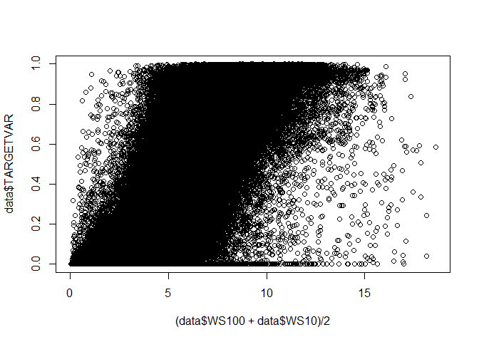<!-- -->

### 4\. How to use the wind direction information?

The wind direction is represented by the angle in degree. It is not good
to directly use the angle in the analysis since the angle of 1 degree
and 359 degree are almost the same direction despite their large
difference. Therefore, we adopt the cosine function of the angle to
perform the analysis.

As is shown in the figures, the absolute values of wind directions can
not provide any insightful information. However, the cosine function of
angles give some interesting results.

First, the distribution of wind direction at 10 meters high and 100
meters high are almost same, which shows the wind direction measurements
work properly. Second, most of the cosine values are -1 and 1, which
means the angle is 180 degree and 0 degree respectively; while less
cosine values are 0, which means the agnle is 90 degre and 270 degree.
This result shows that the wind direction tends to be along the u
direction instead of the v direction in this area where wind farms
locate.

``` r
hist(data$WD10)
```

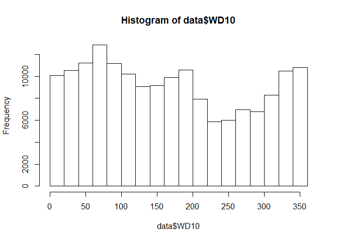<!-- -->

``` r
hist(data$WD100)
```

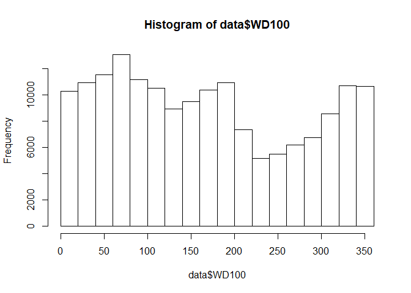<!-- -->

``` r
hist(cos(data$WD10))
```

<!-- -->

``` r
hist(cos(data$WD100))
```

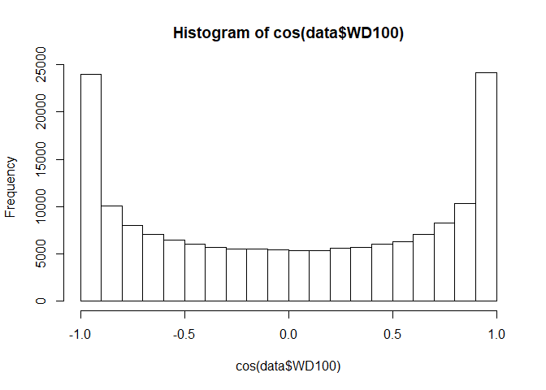<!-- -->

### 5 How about the wind speed and wind power at the 10 different wind farms?

The result shows the average wind speed of the 10 wind farms are roughly
the same. However, the wind farm \#1, \#3 and \#9 tend to have less over
high wind speed. This means these three wind farms tend to have more
secure operation conditions for the wind turbine generators in the
studied years.

Also, the result shows that wind farm \#3, \#5, \#6, \#10 can averagely
generate more wind power than other wind farms. So, these wind farms
should be expanded and we could install more wind turbines at these wind
farms.

``` r
plot(data$ZONEID, data$WS10)
```

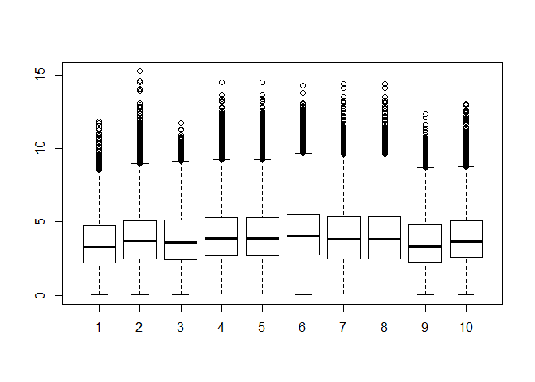<!-- -->

``` r
plot(data$ZONEID, data$WS100)
```

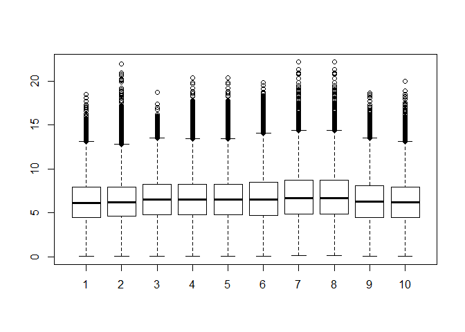<!-- -->

``` r
plot(data$ZONEID, data$TARGETVAR)
```

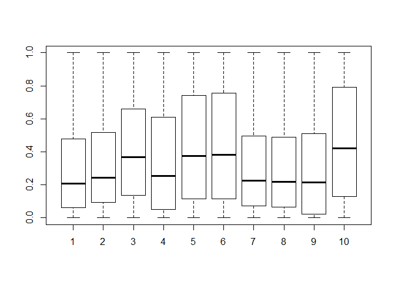<!-- -->
