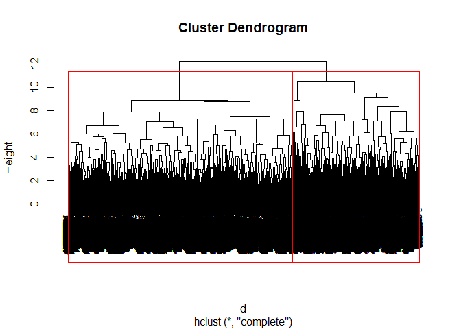
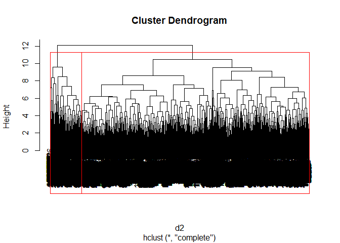

Exploring wind farm data (III): Cluster Analysis
================

## I. Introduction of the three posts

The three posts try to expore 10 large sets of wind farm data where each
one contains 16,800 data points. Although based on the same data set,
the three posts focus on differents aspects.

> Post 1 focuses on the data preprocessing, visualization and some
> preliminary analysis.

> Post 2 focuses on a practical method for anomaly detection or
> maintenance event detection.

> Post 3 focues on the cluster analysis.

The purpose of these three posts are threefolds.

> First, they are final projects in my data mining class and each post
> focuses on different aspects of what we learnt in the class.

> Second, they aim at providing the wind farm owners and electric power
> system operaters with some insights from the huge data sets.

> Finally, they can serve as tutorials for 1st year PhD student in
> power/energy/electrical engineering, so that they can have a basic
> idea to deal with the realistic wind power data in their
> course/reserach projects.

The following sections are organized as follows.

> Section II introduces input data of this post 3.

> Section III gives the problem description of post 3.

> Section IV conducts the cluster analysis

## II. Input Data

### 1 Data source

The data comes from Ref \[1\] and can be downloaded by the link in
\[2\].

> \[1\] Tao Hong, Pierre Pinson, Shu Fan, Hamidreza Zareipour, Alberto
> Troccoli and Rob J. Hyndman, “Probabilistic energy forecasting: Global
> Energy Forecasting Competition 2014 and beyond”, International Journal
> of Forecasting, vol.32, no.3, pp 896-913, July-September, 2016.

> \[2\]
> <http://blog.drhongtao.com/2017/03/gefcom2014-load-forecasting-data.html>

It is orignally prepared for a global competition. The wind farm data
used in this post can be obtained by following steps. We select the data
for Task 15 because it contains the largest number of data points.

> 1)  unzip the file “GEFCom2014-W\_V2.zip”

> 2)  go the the directory: wind \>\> Task15\>\>Task15\_W\_Zone1\_10

### 2 Input data of post 3

The input data of post 3 is the clean data saved after data
preprocessing in post 1 and anomaly detection in post 2. It can be
accessed from the directory “./RData/Clean\_Data.Rdata”.

It has combined the 10 wind farm data togehter, has converted some
attributes and added some new attributes. The 48-hour consecutive
criteria in post 2 is used to detect the anomaly data. There are 790
data points are removed. Finally, the resulted data set contains 167,210
data points and attributes are explanied below.

> 1 TIMESTAMP. It is in the format of “20120101 1:00” which gives the
> year, month, date and hour information.

> 2-5 YEAR, MONTH, DAY, HOUR. Added attributes

> 6 ZONEID. Index of wind farm

> 7 TARGETVAR. It means wind power generation, which has been normalized
> by the nominal capacities of each wind farm.

> 8-9 U10 and V10. They means the wind speeds along u and v directions
> at the height of 10 meters. The u and v directions refer to zonal and
> meridionoal directions.

> 10 WS10. Wind speed at 10 meters height

> 11 WD10. Wind direction at 10 meters height

> 12-13 U100 and V100. Similar with U10 and V10, but they mean the wind
> speed measured at the height of 100 meters.

> 14 WS100. Wind speed at 100 meters height

> 15 WD100. Wind direction at 100 meters height

## III. Problem description

Due to the climate change, the traditional energy resources are
gradually replaced by renewable energies in recent years. The most
promising renewable energy is wind power. However, the wind has very
strong stochastic attribute and the wind power is very hard to be
accurately predicted. This poses a great challenge to electric power
system operators and may make the power system not secure any more. To
ensure the secure operation, we need to improve the wind power
forecasting accuracy. There are many efforts in the power system
community.

This post 3 mainly focuses on the clustering analysis of the wind farm
data. Also, based on the culstering analysis, we aim at giving some
suggestions for the wind farm owners and electricity power system
operators. By mining the wind power generation pattern in different
months of a year and different hours of a day, the system operators can
expect how much power the wind farm can generate, and then can schedule
other power plants (for example, coal-fired power plants) to meet the
electricity demand of customers.

## IV. Cluster analysis

Due to the large size of the data set, we performed the cluster analysis
for each wind farm. For simplicity, this post only show the cluster
analysis for one wind farm, \#1, which contains 16,000 data points.
Despite the reduced data set size, the computation speed is very slow.

### 1 Read the input data

The attribute TIMESTAMP is not suitable to be scaled. So it is excluded
from the analysis. Also, the attribute ZONEID is also excluded because
we only analyze one wind farm data. Therefore, after simple
preprocessing, the data used for cluster analysis are named as “data”
and the index of each attribute is changed as below.

> 1-4 YEAR, MONTH, DAY, HOUR. Added attributes

> 5 TARGETVAR. It means wind power generation, which has been normalized
> by the nominal capacities of each wind farm.

> 6-7 U10 and V10. They means the wind speeds along u and v directions
> at the height of 10 meters. The u and v directions refer to zonal and
> meridionoal directions.

> 8-9 WS10 and WD10. Wind speed and direction at 10 meters height

> 10-11 U100 and V100. Similar with U10 and V10, but they mean the wind
> speed measured at the height of 100 meters.

> 12-13 WS100 and WD100. Wind speed and direction at 100 meters height

``` r
library(fpc)
```

    ## Warning: package 'fpc' was built under R version 3.5.1

``` r
library(cluster)
load(paste("./RData/Clean_Data.Rdata",sep=""))
head(clean_data,3)
```

    ##             TIMESTAMP YEAR MONTH DAY HOUR ZONEID  TARGETVAR      U10
    ## 1 2012-01-01 01:00:00 2012     1   1    1      1 0.00000000 2.124600
    ## 2 2012-01-01 02:00:00 2012     1   1    2      1 0.05487912 2.521695
    ## 3 2012-01-01 03:00:00 2012     1   1    3      1 0.11023400 2.672210
    ##          V10     WS10     WD10     U100      V100    WS100    WD100
    ## 1 -2.6819664 3.421530 141.6144 2.864280 -3.666076 4.652334 141.9997
    ## 2 -1.7969601 3.096451 125.4737 3.344859 -2.464761 4.154892 126.3858
    ## 3 -0.8225162 2.795932 107.1086 3.508448 -1.214093 3.712577 109.0881

``` r
nrow(clean_data)
```

    ## [1] 167210

``` r
summary(clean_data)
```

    ##    TIMESTAMP                        YEAR          MONTH       
    ##  Min.   :2012-01-01 01:00:00   Min.   :2012   Min.   : 1.000  
    ##  1st Qu.:2012-06-24 05:00:00   1st Qu.:2012   1st Qu.: 3.000  
    ##  Median :2012-12-16 01:30:00   Median :2012   Median : 6.000  
    ##  Mean   :2012-12-15 18:49:28   Mean   :2012   Mean   : 6.272  
    ##  3rd Qu.:2013-06-08 11:00:00   3rd Qu.:2013   3rd Qu.: 9.000  
    ##  Max.   :2013-12-01 00:00:00   Max.   :2013   Max.   :12.000  
    ##  NA's   :20                                                   
    ##       DAY             HOUR          ZONEID        TARGETVAR      
    ##  Min.   :  1.0   Min.   : 0.0   1      :16800   Min.   :0.00000  
    ##  1st Qu.: 88.0   1st Qu.: 6.0   3      :16800   1st Qu.:0.08301  
    ##  Median :175.0   Median :12.0   4      :16800   Median :0.28350  
    ##  Mean   :175.7   Mean   :11.5   6      :16800   Mean   :0.36203  
    ##  3rd Qu.:263.0   3rd Qu.:18.0   7      :16800   3rd Qu.:0.60772  
    ##  Max.   :366.0   Max.   :23.0   10     :16800   Max.   :1.00000  
    ##                                 (Other):66410                    
    ##       U10               V10                 WS10         
    ##  Min.   :-8.3716   Min.   :-12.92358   Min.   : 0.02323  
    ##  1st Qu.:-1.5040   1st Qu.: -2.16043   1st Qu.: 2.48948  
    ##  Median : 0.5446   Median :  0.36068   Median : 3.71608  
    ##  Mean   : 0.8175   Mean   :  0.08673   Mean   : 3.99721  
    ##  3rd Qu.: 2.8047   3rd Qu.:  2.33933   3rd Qu.: 5.17349  
    ##  Max.   :14.8372   Max.   : 11.40140   Max.   :15.23372  
    ##                                                          
    ##       WD10               U100              V100           
    ##  Min.   :  0.0056   Min.   :-12.425   Min.   :-19.791997  
    ##  1st Qu.: 75.6642   1st Qu.: -2.414   1st Qu.: -3.870784  
    ##  Median :159.4702   Median :  1.057   Median :  0.702527  
    ##  Mean   :169.4062   Mean   :  1.281   Mean   :  0.005481  
    ##  3rd Qu.:264.1687   3rd Qu.:  4.752   3rd Qu.:  4.071184  
    ##  Max.   :359.9943   Max.   : 21.399   Max.   : 16.304799  
    ##                                                           
    ##      WS100              WD100        
    ##  Min.   : 0.01282   Min.   :  0.004  
    ##  1st Qu.: 4.68091   1st Qu.: 73.986  
    ##  Median : 6.39227   Median :155.963  
    ##  Mean   : 6.58516   Mean   :167.504  
    ##  3rd Qu.: 8.23011   3rd Qu.:262.648  
    ##  Max.   :22.15552   Max.   :359.998  
    ## 

``` r
data <- scale(clean_data[,c(2:5,7:15)])
```

### 2 Hierarchical clustering with Euclidean distance

Use the wind farm \#1 as an example. The cluster analysis for other wind
farms are the similar and are omitted here for simplicity.

From the dendogram, we can see it’s better to have 2 groups. Each group
contains 10,733 data points and 6067 data points, respectively.

From the cluster analysis, we can have following observations.

> The group \#1 is characterized as low wind power, low wind speed,
> large wind speed angle (no matter at 10 meters or 100 meters height);
> They tend to occur at the first half year, i.e., from January to June.
> On each day, they tend to occur at the second half day, i.e., around
> the afternoon and the evening.

> The group \#2 is characterized as high wind power, high wind speed,
> large wind speed angle (no matter at 10 meters or 100 meters height);
> They tend to occur at the second half year, i.e., from July to
> December. On each day, they tend to occur at the first half day, i.e.,
> early in the morning.

``` r
data1 <- data[which(clean_data$ZONEID==1),]
d <- dist(data1, method = "euclidean") #heirarchical clustering
fit <- hclust(d, method="complete")
plot(fit)
rect.hclust(fit, k=2, border="red")
```

<!-- -->

``` r
groups <- cutree(fit, k=2)
x<-cbind(data1,groups)
x1<- subset(x, groups==1)
x2<- subset(x, groups==2)
nrow(x1)
```

    ## [1] 10733

``` r
nrow(x2)
```

    ## [1] 6067

``` r
tab <- as.data.frame(matrix(NA,nrow=13,ncol=6))
names(tab) <- c("C1.m","C1.sd","C2.m","C2.sd","All.m","All.sd")
row.names(tab) <- names(data1)
tab[,5] <- round(colMeans(data1,2))
tab[,6] <- round(apply(data1,2,sd),2)
for(i in 1:2){
cluster.data <- data1[groups==i,]
tab[,2*i-1] <- round(colMeans(cluster.data),2)
tab[,2*i] <- round(apply(cluster.data,2,sd),2)
}
tab
```

    ##     C1.m C1.sd  C2.m C2.sd All.m All.sd
    ## 1   0.03  1.00 -0.05  1.00     0   1.00
    ## 2  -0.12  1.02  0.22  0.92     0   1.00
    ## 3  -0.12  1.02  0.22  0.91     0   1.00
    ## 4   0.12  0.95 -0.22  1.04     0   1.00
    ## 5  -0.66  0.52  0.65  0.91     0   0.93
    ## 6  -0.25  0.60  0.56  0.95     0   0.84
    ## 7   0.01  0.70 -0.32  1.22     0   0.94
    ## 8  -0.70  0.54  0.68  0.73     0   0.91
    ## 9   0.15  1.01 -0.35  0.74     0   0.95
    ## 10 -0.23  0.70  0.57  0.94     0   0.88
    ## 11  0.02  0.78 -0.34  1.23     0   0.98
    ## 12 -0.60  0.64  0.76  0.72     0   0.93
    ## 13  0.13  1.02 -0.35  0.74     0   0.96

### 3 Stability of the Culster

To check the stability of the clusters, we removed a random 5% of the
data (by taking a random sample of 95% of the records), and repeated the
analysis. The number of points in each group are quite different from
before. But the labels of each clusters are quite similar with the
labels before. So, the stability of the clusters are not bad.

``` r
xx1 <- sample(1:nrow(data1), round(0.95*nrow(data1)), replace=F)
xx2 <- sort(xx1)
data2 = data1[xx2,]
nrow(data2)
```

    ## [1] 15960

``` r
d2 <- dist(data2, method = "euclidean") #heirarchical clustering
fit2 <- hclust(d2, method="complete")
plot(fit2)
rect.hclust(fit2, k=2, border="red")
```

<!-- -->

``` r
groups2 <- cutree(fit2, k=2)
x<-cbind(data2,groups2)
x1<- subset(x, groups2==1)
x2<- subset(x, groups2==2)
nrow(x1)
```

    ## [1] 14016

``` r
nrow(x2)
```

    ## [1] 1944

``` r
tab <- as.data.frame(matrix(NA,nrow=13,ncol=6))
names(tab) <- c("C1.m","C1.sd","C2.m","C2.sd","All.m","All.sd")
row.names(tab) <- names(data2)
tab[,5] <- round(colMeans(data2,2))
tab[,6] <- round(apply(data2,2,sd),2)
for(i in 1:2){
cluster.data <- data2[groups2==i,]
tab[,2*i-1] <- round(colMeans(cluster.data),2)
tab[,2*i] <- round(apply(cluster.data,2,sd),2)
}
tab
```

    ##     C1.m C1.sd  C2.m C2.sd All.m All.sd
    ## 1  -0.01  1.00  0.12  1.00     0   1.00
    ## 2  -0.05  1.02  0.33  0.73     0   1.00
    ## 3  -0.04  1.02  0.32  0.73     0   1.00
    ## 4   0.03  0.99 -0.26  1.05     0   1.00
    ## 5  -0.39  0.77  1.23  0.72     0   0.93
    ## 6  -0.09  0.75  0.95  0.89     0   0.84
    ## 7   0.02  0.83 -0.99  1.15     0   0.94
    ## 8  -0.41  0.72  1.26  0.72     0   0.90
    ## 9   0.02  1.00 -0.39  0.40     0   0.95
    ## 10 -0.07  0.81  0.98  0.86     0   0.88
    ## 11  0.01  0.89 -0.97  1.14     0   0.98
    ## 12 -0.32  0.76  1.38  0.66     0   0.93
    ## 13  0.01  1.00 -0.38  0.40     0   0.96

### 4 k-means clustering

We then use k-means clustering with the same data and same number of
clusters as in Section IV-2. The labels of the two groups are similar
with hierarchical clustering. Also, the number of points in each group
are also similar. This demonstrates very good consistency.

``` r
fit3 <- kmeans(data1, 2)
fit3$center  # centers of each variable
```

    ##          YEAR      MONTH        DAY        HOUR     TARGETVAR        U10
    ## 1  0.03068541 -0.3183814 -0.3189388  0.10523995 -0.5687070383 -0.8088600
    ## 2 -0.01514156  0.1614044  0.1618534 -0.05280604  0.0002055403  0.4611708
    ##          V10          WS10       WD10       U100       V100     WS100
    ## 1  0.2909998 -0.6117452187  1.0798689 -0.8664054  0.2808394 -0.537739
    ## 2 -0.3070562 -0.0003394124 -0.5893743  0.5208600 -0.3040105  0.107589
    ##       WD100
    ## 1  1.083049
    ## 2 -0.599261

``` r
fit3$size
```

    ## [1]  5586 11214

``` r
groups3 <- fit3$cluster
x<-cbind(data1,groups3)
x1<- subset(x, groups3==1)
x2<- subset(x, groups3==2)
nrow(x1)
```

    ## [1] 5586

``` r
nrow(x2)
```

    ## [1] 11214

``` r
tab <- as.data.frame(matrix(NA,nrow=13,ncol=6))
names(tab) <- c("C1.m","C1.sd","C2.m","C2.sd","All.m","All.sd")
row.names(tab) <- names(data1)
tab[,5] <- round(colMeans(data1,2))
tab[,6] <- round(apply(data1,2,sd),2)
for(i in 1:2){
cluster.data <- data1[groups3==i,]
tab[,2*i-1] <- round(colMeans(cluster.data),2)
tab[,2*i] <- round(apply(cluster.data,2,sd),2)
}
tab
```

    ##     C1.m C1.sd  C2.m C2.sd All.m All.sd
    ## 1   0.03  1.00 -0.02  1.00     0   1.00
    ## 2  -0.32  1.06  0.16  0.93     0   1.00
    ## 3  -0.32  1.06  0.16  0.93     0   1.00
    ## 4   0.11  0.96 -0.05  1.01     0   1.00
    ## 5  -0.57  0.65  0.00  0.99     0   0.93
    ## 6  -0.81  0.36  0.46  0.68     0   0.84
    ## 7   0.29  0.70 -0.31  0.97     0   0.94
    ## 8  -0.61  0.67  0.00  0.94     0   0.91
    ## 9   1.08  0.55 -0.59  0.53     0   0.95
    ## 10 -0.87  0.41  0.52  0.67     0   0.88
    ## 11  0.28  0.77 -0.30  1.02     0   0.98
    ## 12 -0.54  0.73  0.11  0.95     0   0.93
    ## 13  1.08  0.55 -0.60  0.53     0   0.96

## 5 Summary

These results can provide very useful insights for wind farm owners and
power system operators to schedue the power output while satisfying the
electricity demand of customers. For example,

> In the first half year, and in an afternoon, we can expect the wind
> speed is generally slow and wind power is not very enough. Then the
> power system operators can schedule the traditional coal-fired power
> plant to generate more electricity for the customers.

> In the second half year, and in the morning, we can expect the wind
> speed is generally fast and wind power is sufficient to meet the
> customer demand. To make full use of the renewable energy, we may want
> the wind turbine to generate as many power as possible, so that the
> other power coal-fired plants can generate less power. This can help
> reduce the carbon emission.
